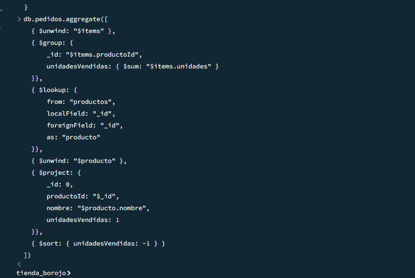
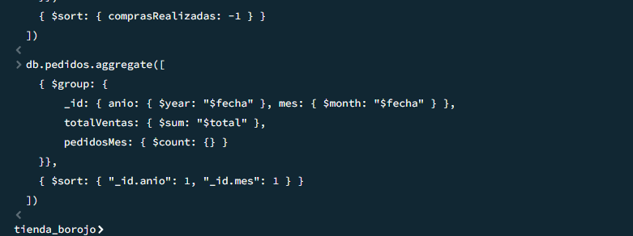

# Tiendadelborojo

CREACIÓN DE LAS COLECCIONES

CLIENTES

VENTAS 

PROVEEDORES

INVENTARIO

CONFIRMAR QUE EFCETIVAMENTE SE EJECUTO 

INSERCCIONES y VERIFICACIONES

3. LECTURA
 Productos con stock > 20

3.1  Clientes que no han comprado (array vacío o inexistente)

4. Actualización (UPDATE)

4.1  Aumentar en 10 el stock de "Borojó deshidratado"

4.2  Añadir el tag "bajo azúcar" a TODOS los productos de categoría "Bebida"

5. ELIMINACIÓN

5.1 Eliminar el cliente con email "juan@email.com"

5.2 Verifica (debe dar 0 resultados):

5.3 Eliminar todos los productos con stock < 5

5.4  Verifica cuántos quedaron con stock < 5 (idealmente 0):

6. Consultas con Expresiones Regulares (REGEX)

6.1 Productos cuyo nombre **empiece** por "Boro"

6.2 . Productos cuyo nombre contenga "con"
Opción A: "con" como **palabra completa** (ej. "Galletas con borojó")

6.3 Encontrar clientes cuyo nombre tenga la letra "z"

7.Operadores en consultas sobre arrays

7.1 Buscar clientes que tengan "natural" en sus preferencias

7.2 Encontrar productos que tengan al menos los tags "natural" y "orgánico" (usando $all)

7.3 Listar productos que tienen más de un tag

8.Aggregation Framework con Pipelines

8.1 Productos más vendidos (suma de unidades por producto)

8.2 Agrupar clientes por cantidad de compras realizadas

8.3  Total de ventas por mes ($group + $month)

8.4 Promedio de precios por categoría de producto

8.5 Top 3 productos con mayor stock ($sort + $limit)

9.INDEXACIONES

9.1 Índice en productos.nombre

9.2 Índice compuesto en productos sobre categoria y precio

9.3 Índice en clientes.email para duplicados (único)

9.4 Verificar con explain() si el índice de nombre se usa

