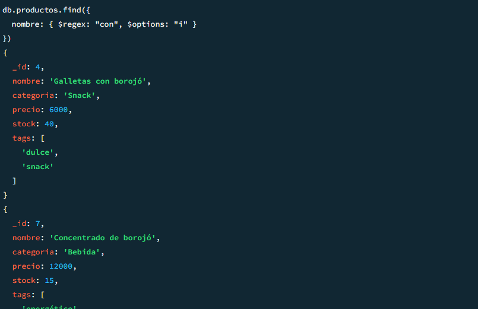
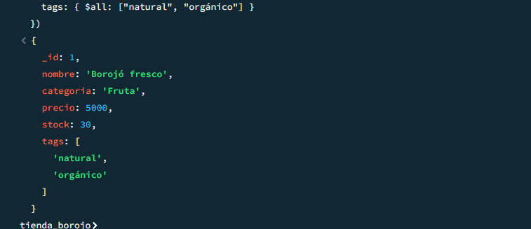

CREACIÓN DE LAS COLECCIONES

CLIENTES

VENTAS 

PROVEEDORES

INVENTARIO

CONFIRMAR QUE EFCETIVAMENTE SE EJECUTO 

INSERCCIONES y VERIFICACIONES

1.Inserción (INSERT)

1.1 Nuevo producto: “Chocolatina de borojó”

1.2 Nuevo cliente: “Mario Mendoza”

2) Lectura (READ)
2.1 Productos con stock > 20

2.2 Clientes que no han comprado (array vacío o inexistente)

